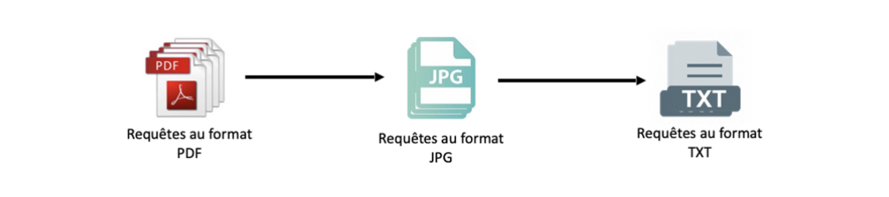

# Étape 1 - OCR *(Reconnaissance Optique des Caractères)*

Les requêtes déposées sont consignées dans les bases de données au format `PDF`. Ces documents proviennent de scans effectués par des citoyens ou des avocats ayant formulé des demandes auprès des tribunaux.

Cependant, les fichiers `PDF` ne sont pas dotés de capacités d'OCR, ce qui implique que le contenu textuel de ces fichiers n'est pas directement accessible ni sélectionnable. Afin de traiter ces données et d'extraire le texte correspondant, les étapes suivantes sont entreprises :

1. Les fichiers `PDF` sont convertis en images en utilisant la bibliothèque `pdf2image`. Chaque page du `PDF` est transformée en une image individuelle. Si le `PDF` est composé de X pages, cela génère X images. Cette conversion est réalisée grâce au script `pdf2img.py`.

2. Par la suite, ces images sont soumises à une reconnaissance optique de caractères (OCR, Optical Character Recognition) pour être converties en fichiers texte au format `.txt`. Cette transformation est réalisée en utilisant la bibliothèque `pytesseract`. Vous pouvez retrouver cette opération dans le script `img2txt.py`.
