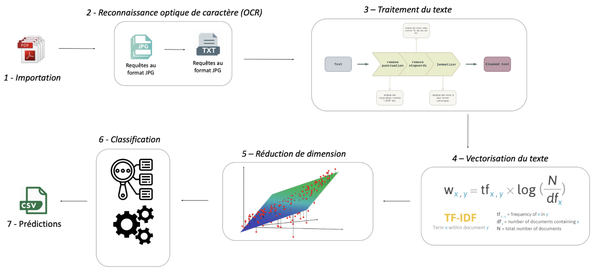
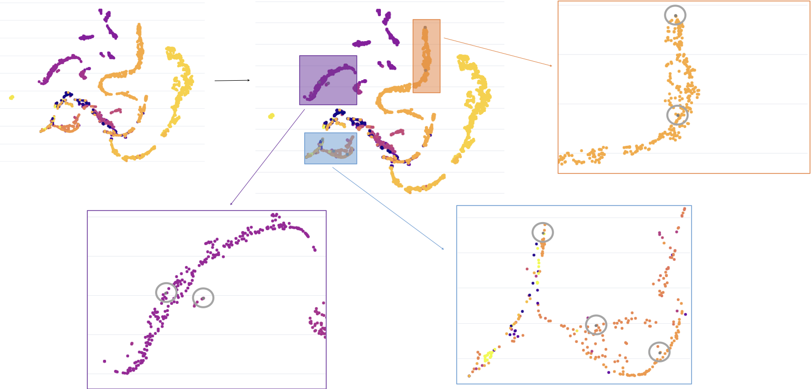

# 10 - Application

Une application conviviale a été développée en utilisant la bibliothèque `streamlit`.

 

Lorsque de nouveaux documents au format `PDF` (requêtes juridiques) sont ajoutés à l'application, le flux de traitement se met en marche. Tout d'abord, l'OCRisation des documents est effectuée, permettant ainsi de rendre le texte contenu dans les `PDF` accessible. Ensuite, le nettoyage du texte est entrepris, suivi de la création des embeddings et de la réduction de dimension. Il est important de noter les points gris qui apparaîtront sur les graphiques, positionnés en fonction de leurs similarités avec d'autres requêtes.

 

Enfin, les prédictions générées par le modèle sont mises à disposition sous forme de fichier CSV téléchargeable.
