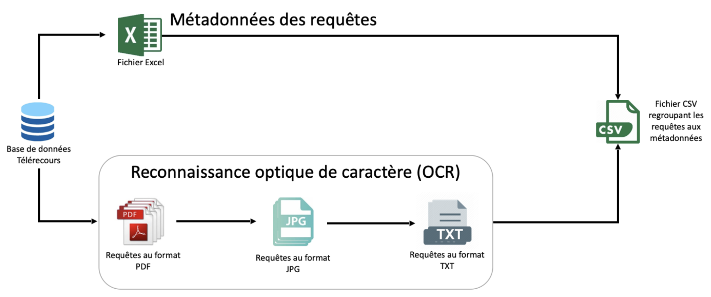
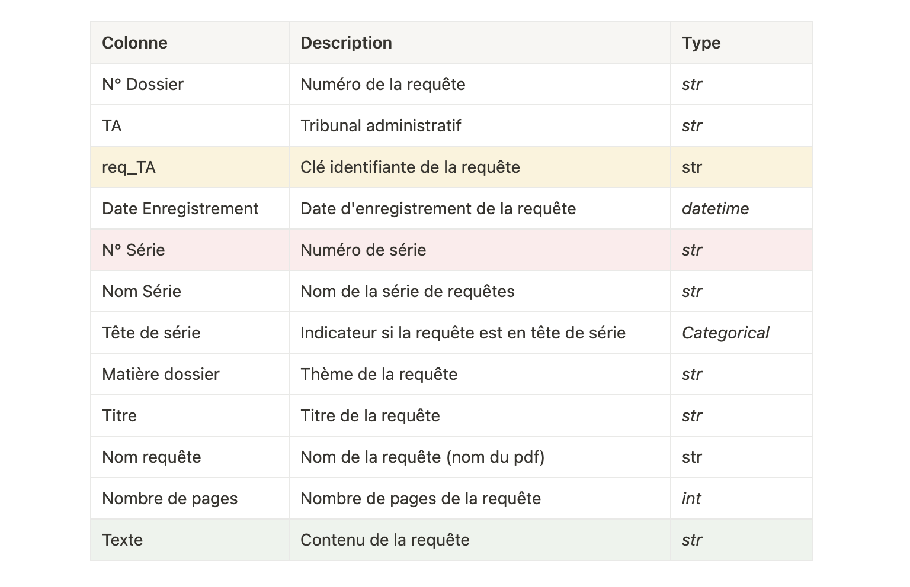

# 2 - Données

Pour entraîner et évaluer notre modèle, nous avons utilisé un ensemble de données comprenant un vaste échantillon de requêtes juridiques. Ces données ont été fournies par le Conseil d'État et contiennent une variété de métadonnées associées à chaque requête, telles que le numéro de série, le tribunal, la matière dossier, le titre et la date d'enregistrement.

Les données brutes se présentent sous forme de fichiers PDF, ce qui nécessite un processus de prétraitement pour les rendre exploitables. Comme expliqué dans la première section (1 - OCR), nous avons converti ces fichiers PDF en textes extraits grâce à la reconnaissance optique de caractères (OCR). Cette étape nous a permis d'obtenir des fichiers texte (.txt) contenant le contenu des requêtes.
