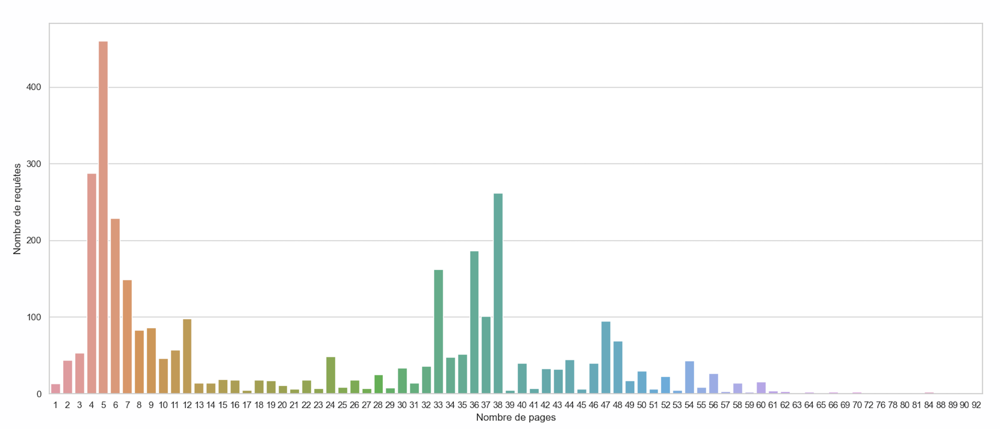
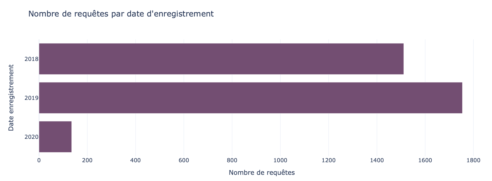
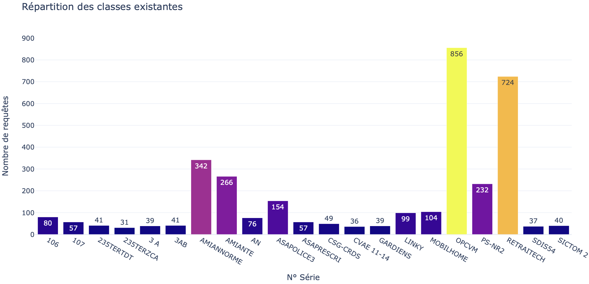

# 3 - Exploration des données

l’exploration des relations entre les variables, une analyse de la répartition des requêtes a été réalisée en fonction du nombre de pages et de leurs dates d’enregistrement. Ces analyses ont permis de visualiser la distribution des requêtes, offrant un aperçu significatif de la structure temporelle et volumétrique des données.

<figure>
    
    <figcaption>Répartition des requêtes selon leurs nombre de pages</figcaption>
</figure>

Une étude de la répartition des requêtes par séries a également été entreprise. Il a été constaté que certaines séries comportent un nombre significativement plus réduit de requêtes par rapport à d’autres séries.

