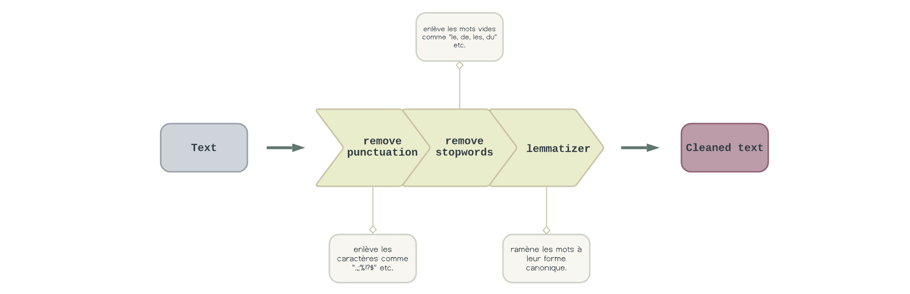
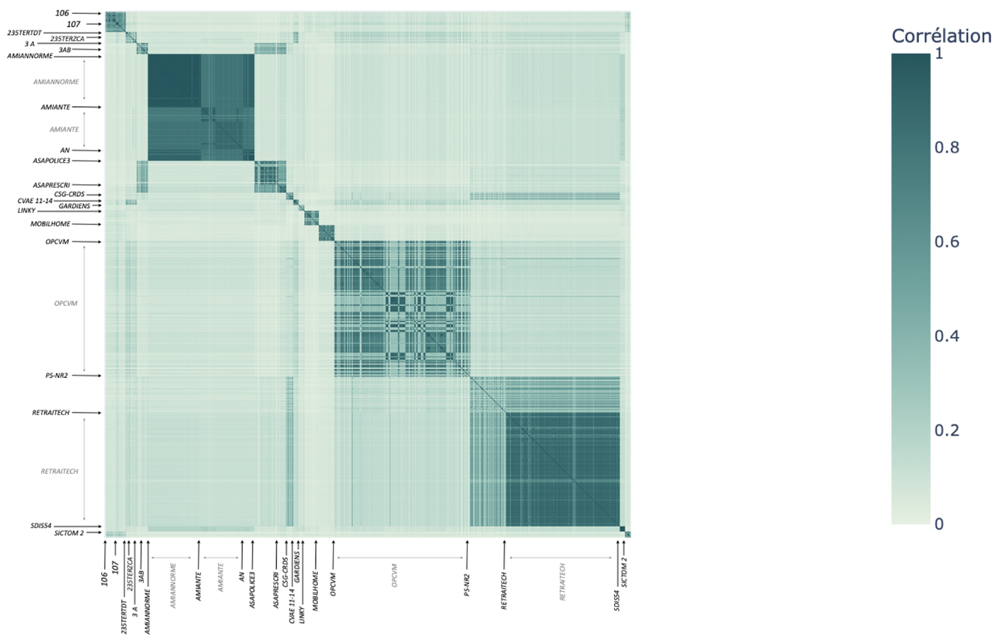

# 4 - Text Processing *(Traitement du texte)*

Le traitement du texte est une étape fondamentale dans le processus de préparation des données pour l'analyse. Dans ce projet, nous avons mis en place une série de fonctions visant à nettoyer et préparer les données textuelles, permettant ainsi d'améliorer la qualité de nos analyses.

Les fonctions nécessaires pour le nettoyage du texte sont regroupées dans le fichier `PreprocessingOptimized.py`. 



Pour les utiliser, il vous suffit de les importer et de les appliquer à vos données.

Voici comment vous pouvez les utiliser dans votre code :

```python
import PreprocessingOptimized

data['text'] = data['text'].apply(lambda x: PreprocessingOptimized.nlp(x, disable="spellcheck_Spellchecker").text)
```

L'argument `disable="spellcheck_Spellchecker"` permet de désactiver la composante de correction orthographique `spellcheck_Spellchecker` de la pipeline de traitement du texte.

Les fonctions nécessaire pour nettoyer le text se trouvent dans le fichier `PreprocessingOptimized.py`

Une fois que le texte a été nettoyé et prétraité, il est important de le transformer en vecteurs numériques pour l'analyse. À cet effet, nous avons développé le fichier `TextEmbedding.py`.

L'utilisation de ce fichier pour transformer le texte en vecteurs est la suivante :

```python
import TextEmbedding

tf_idf = TextEmbedding.get_tf_idf(data, "text")
```

Une fois que nous avons obtenu nos embeddings TF-IDF, nous sommes en mesure de réaliser une étude de corrélation entre les requêtes juridiques et leurs numéros de série. 
Cette analyse est rendue possible grâce à la mesure de similarité de Cosinus.




Cette approche nous permet de visualiser et de comprendre plus en profondeur les schémas et les tendances sous-jacentes aux séries de requêtes juridiques.
