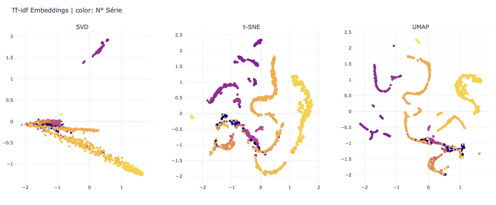
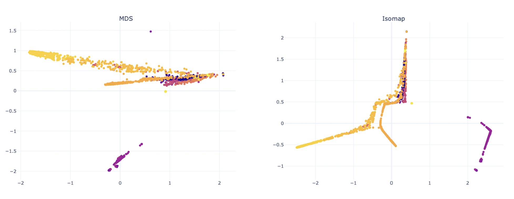

# 5 - Réduction de dimension

Pour la réduction de la dimension des embeddings, nous avons mis à disposition les fonctions nécessaires dans le fichier `DimensionalityReduction.py`.

Pour les utiliser, il suffit de les importer et de les appliquer aux données comme suit :

```python
import DimensionalityReduction

embeddings = DimensionalityReduction.reduce_tf_idf_dimensions(tf_idf)
```

Par défaut, les dimensions sont réduites à 2D, mais si vous souhaitez modifier la dimension, vous pouvez le faire en spécifiant l'argument dimension=3 (par exemple).

Une fois que les embeddings sont obtenus, nous les fusionnons avec nos données d'origine pour obtenir les embeddings et leurs labels (N° Série) associés :

```python
data_embedds = pd.concat(
    [data,
     pd.DataFrame(embeddings["SVD"], columns=["SVD_x", "SVD_y"]),
     pd.DataFrame(embeddings["t-SNE"], columns=["t-SNE_x", "t-SNE_y"]),
     pd.DataFrame(embeddings["UMAP"], columns=["UMAP_x", "UMAP_y"])], axis=1)

assert data_embedds.shape[0] == data.shape[0]
```

En ce qui concerne la visualisation des embeddings, nous avons également créé un fichier `Plots.py`.

- Utilisation
```python
from plotly.subplots import make_subplots

fig = make_subplots(1, 3,
                    subplot_titles=("SVD", "t-SNE", "UMAP"))

Plots.plot_embeddings(fig, embeddings["SVD"], "SVD", data, row=1, col=1)
Plots.plot_embeddings(fig, embeddings["t-SNE"], "t-SNE", data, row=1, col=2)
Plots.plot_embeddings(fig, embeddings["UMAP"], "UMAP", data, row=1, col=3)

fig.update_layout(height=600, width=1500, title_text="Tf-idf Embeddings | color: N° Série", template="plotly_white")
fig.write_html("svd_tsne_umap.html")

fig.show()
```




Vous pouvez cliquer sur les liens ci-dessous pour interagir avec les graphiques en 2D et 3D :

- Graphe SVD, t-SNE et UMAP en 2D

- Graphe SVD, t-SNE et UMAP en 3D
